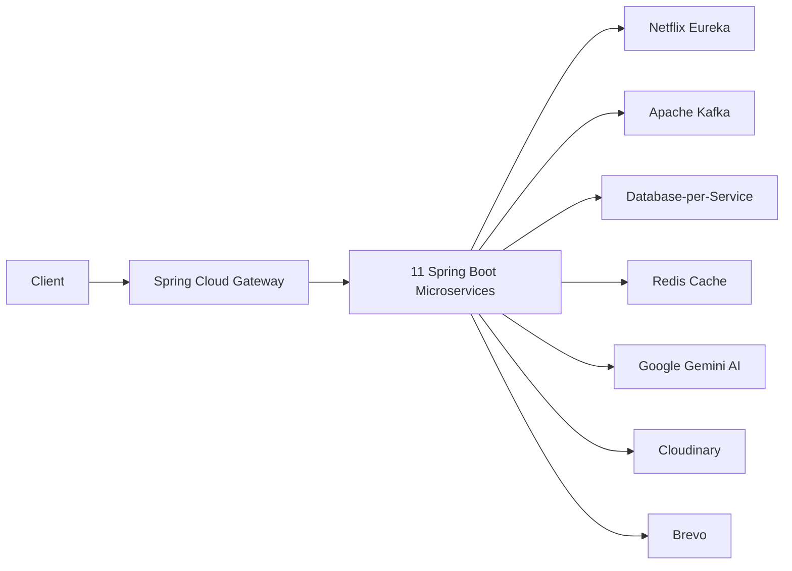

<div align="center">

# AI Job Portal


**Production-Ready AI-Powered Recruitment Platform**

A modern full-stack recruitment platform built with **Java 21**, **Spring Boot 3**, **Spring Cloud**, **React 19**, and **Google Gemini AI**, following a distributed event-driven microservices architecture.

<br>

[](https://openjdk.org/)
[](https://spring.io/projects/spring-boot)
[](https://react.dev/)
[](https://www.typescriptlang.org/)
[](https://www.postgresql.org/)
[](https://kafka.apache.org/)
[](https://redis.io/)
[](https://www.docker.com/)
[](LICENSE)

</div>

---

# Overview

AI Job Portal is a production-ready full-stack recruitment platform designed around a distributed microservices architecture. The platform provides intelligent hiring workflows for **Candidates**, **Recruiters**, and **Administrators**, combining secure authentication, event-driven communication, AI-powered recruitment, and cloud-native deployment.

The backend consists of independently deployable Spring Boot microservices communicating through REST APIs and Apache Kafka, while the frontend is built with React, TypeScript, and Vite to deliver a responsive, modern user experience.

---

# Architecture at a Glance

| | | |
|---|---|---|
| **11 Microservices** | **Java 21** | **Spring Boot 3** |
| Spring Cloud | Apache Kafka | Redis |
| PostgreSQL | React 19 | TypeScript |
| Google Gemini AI | Docker | Vercel |
| Railway + Render | OpenFeign | Resilience4j |

---

# Repository Structure

```
AI-Job-Portal/
│
├── ai-job-portal-backend/
│
├── ai-job-portal-frontend/
│
├── assets/
│   ├── banner.png
│   ├── homepage.png
│   ├── candidate-dashboard.png
│   ├── recruiter-dashboard.png
│   ├── admin-dashboard.png
│   ├── resume-analysis.png
│   └── ai-job-description.png
│
└── README.md
```

---

# System Architecture

The platform follows a **Distributed Event-Driven Microservices Architecture**. Client requests are routed through Spring Cloud Gateway, services are discovered using Eureka, synchronous communication is handled through OpenFeign, and asynchronous communication is powered by Apache Kafka.



---

# Technology Stack

| Layer | Technologies |
|------|---------------|
| Backend | Java 21, Spring Boot 3, Spring Cloud |
| Frontend | React 19, TypeScript, Vite |
| Database | PostgreSQL |
| Cache | Redis |
| Messaging | Apache Kafka |
| AI | Google Gemini AI |
| Authentication | Spring Security, JWT, OAuth2 |
| Cloud Storage | Cloudinary |
| Email | Brevo |
| Documentation | SpringDoc OpenAPI |
| Deployment | Docker, Railway, Render, Vercel |

---

# Screenshots

| Feature | Preview |
|----------|---------|
| Home Page |  |
| Candidate Dashboard |  |
| Recruiter Dashboard |  |
| Admin Dashboard |  |
| Resume Analysis |  |
| AI Job Description |  |

---

# Project Modules

| Module | Description |
|---------|-------------|
| Authentication | Secure JWT authentication with email verification and password reset |
| Candidate | Resume management, ATS analysis, job matching, applications |
| Recruiter | Company management, job posting, AI-assisted hiring |
| Admin | Platform management, moderation, analytics |
| AI | Resume analysis, ATS scoring, recommendations, content generation |

---

# Features

| Module | Highlights |
|--------|------------|
| Authentication | JWT Authentication, Refresh Tokens, Email Verification, Password Reset, RBAC |
| Candidate | Resume Upload, Resume Analysis, ATS Score, Skill Gap Analysis, AI Job Matching, Saved Jobs, Applications |
| Recruiter | Company Profile, Job Management, AI Job Description Generation, Candidate Ranking |
| Admin | User Management, Company Verification, Job Moderation, Dashboard & Analytics |
| AI | Resume Analysis, ATS Scoring, Explainable Matching, Learning Roadmap, Cover Letter & Interview Question Generation |
| Notifications | Email & In-App Notifications powered by Apache Kafka |

---

# Deployment

| Component | Platform |
|-----------|----------|
| Frontend | Vercel |
| API Gateway | Railway |
| Backend Microservices | Railway + Render |
| Database | PostgreSQL |
| Cache | Redis |
| Event Streaming | Apache Kafka |
| Storage | Cloudinary |

---

# Local Development

### Clone Repository

```bash
git clone https://github.com/PRAHLAD09-dev/ai-job-portal.git
cd ai-job-portal
```

### Backend

```bash
cd ai-job-portal-backend

docker compose up -d

mvn clean install

mvn spring-boot:run
```

### Frontend

```bash
cd ai-job-portal-frontend

npm install

npm run dev
```

Application

```
Frontend : http://localhost:5173

Backend  : http://localhost:8080
```

---

# Engineering Highlights

| Area | Implementation |
|------|----------------|
| Architecture | Distributed Event-Driven Microservices with 11 independently deployable Spring Boot services |
| Communication | OpenFeign for synchronous APIs and Apache Kafka for asynchronous domain events |
| Security | Spring Security, JWT Authentication, OAuth2, RBAC, BCrypt, Internal Service Authentication |
| AI | Google Gemini AI for resume analysis, ATS scoring, explainable matching, and AI-powered content generation |
| Data | Database-per-Service architecture with PostgreSQL and Redis caching |
| Deployment | Multi-cloud deployment across Railway, Render, Vercel, and Docker |

---

# Future Roadmap

- Google OAuth 2.0
- OCR support for scanned resumes
- Real-time notifications with WebSockets
- Advanced recruiter analytics
- Interview scheduling
- Mobile application
- Kubernetes deployment
- CI/CD pipeline with GitHub Actions

---

# Live Demo

| Resource | URL |
|----------|-----|
| Frontend | https://ai-job-portal-opal-iota.vercel.app |
| Backend Repository | https://github.com/PRAHLAD09-dev/ai-job-portal/tree/main/ai-job-portal-backend |
| Frontend Repository | https://github.com/PRAHLAD09-dev/ai-job-portal/tree/main/ai-job-portal-frontend |

---

# Contributing

Contributions are welcome.

1. Fork the repository.
2. Create a feature branch.
3. Commit your changes.
4. Push to your fork.
5. Open a Pull Request.

---

# License

This project is licensed under the **MIT License**.

---

# Author

## Prahlad Bhakat

Java Full Stack Developer passionate about building scalable distributed systems using **Java**, **Spring Boot**, **React**, **Microservices**, and **Artificial Intelligence**.

**Connect**

[](https://github.com/PRAHLAD09-dev)
[](https://linkedin.com/in/prahlad-bhakat)
[](mailto:prahladbhakat05@gmail.com)

---

<div align="center">

**If you found this project helpful, consider giving it a ⭐**

</div>