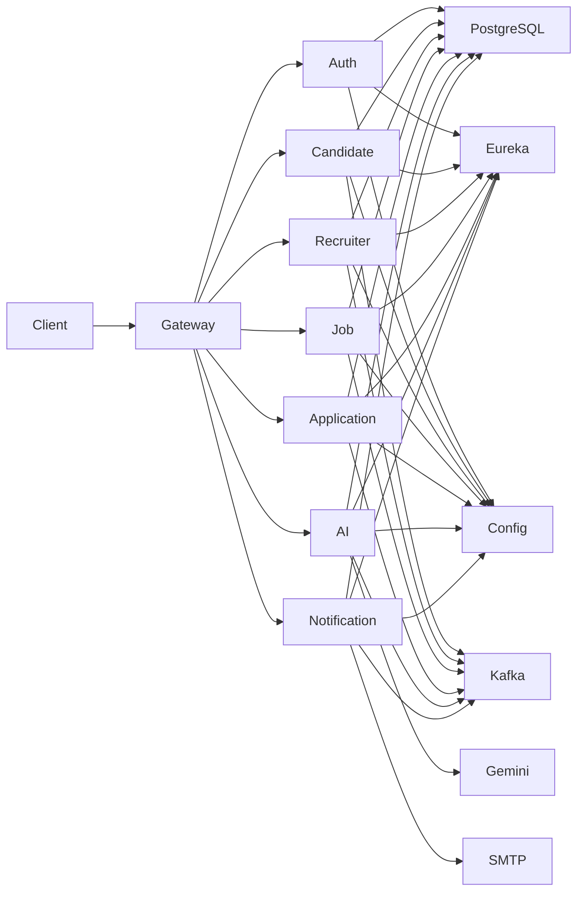

<div align="center">

# AI Job Portal Platform

### Enterprise-Grade AI Powered Recruitment Platform

Production-ready recruitment platform built using **Spring Boot Microservices**, **Apache Kafka**, **Redis**, **PostgreSQL**, **Docker**, and **Google Gemini AI**.


</div>

---

# Project Overview

AI Job Portal Platform is an enterprise-grade recruitment backend designed using **Microservices Architecture**. Every business capability is isolated into an independent service that communicates through **REST APIs** and **Apache Kafka**. The platform demonstrates secure authentication, distributed caching, AI-powered recruitment, centralized configuration, and production-ready deployment practices.

---

# Objectives

- Enterprise Spring Boot Microservices
- Distributed System Design
- JWT Authentication & RBAC
- AI Assisted Recruitment
- Event-Driven Architecture
- Production Ready Backend

---

# Key Features

| Module | Features |
|---------|----------|
| Authentication | Login, Registration, JWT, Refresh Token, Email Verification, Password Reset |
| Candidate | Profile, Resume, Skills, Education, Experience |
| Recruiter | Company Management, Recruiters, Branding |
| Job | Job Posting, Search, Filtering, Saved Jobs, Alerts |
| Application | Apply Job, Timeline, Status Tracking |
| AI | Resume Analysis, ATS Score, Recommendations, Interview Questions, Cover Letter, Job Description, Skill Gap Analysis |
| Notification | Email Notifications, Kafka Consumers, Notification Preferences |

---

# Project Status

| Service | Status |
|----------|--------|
| Auth Service | Completed |
| Candidate Service | Completed |
| Recruiter Service | Completed |
| Job Service | Completed |
| Application Service | Completed |
| AI Service | Completed |
| Notification Service | Completed |

---

# Enterprise Architecture

The platform follows **Database-per-Service**, **Event-Driven Communication**, and **Centralized Configuration** patterns. Business services communicate synchronously through **OpenFeign** and asynchronously using **Apache Kafka**, while **Redis** accelerates frequently accessed data.



---

# Engineering Principles

- Domain Driven Microservices
- Feature-Based Package Structure
- DTO Based Communication
- Stateless REST APIs
- Centralized Configuration
- Event-Driven Workflows
- Independent Deployments
- SOLID Principles
- Containerized Infrastructure
- Production-Oriented Design

---

# Microservices Overview

The platform is divided into independent business services. Every service owns its own domain logic, persistence layer, REST APIs, and configuration. Communication between services is performed using REST (OpenFeign) for synchronous operations and Apache Kafka for asynchronous event-driven workflows.

| Service | Port | Responsibility |
|----------|------|----------------|
| API Gateway | 8080 | Single entry point, request routing, authentication forwarding |
| Auth Service | 8081 | Authentication, JWT, Refresh Token, Email Verification, Password Reset |
| Candidate Service | 8082 | Candidate profile, resume, education, experience, skills |
| Recruiter Service | 8083 | Recruiter accounts, company management, company profile |
| Job Service | 8084 | Job posting, search, filtering, saved jobs, job alerts |
| Application Service | 8085 | Job applications, hiring workflow, application timeline |
| AI Service | 8086 | Resume analysis, ATS score, recommendations, AI generation |
| Notification Service | 8087 | Email notifications, Kafka consumers, notification preferences |
| Eureka Server | 8761 | Service discovery |
| Config Server | 8888 | Centralized configuration |

---

## Service Communication

The project uses a hybrid communication model.

### Synchronous Communication

OpenFeign Clients are used whenever an immediate response is required.

Examples:

- Candidate → Job Service
- Application → Job Service
- Application → Recruiter Service
- AI → Candidate Service
- AI → Job Service
- Notification → Auth Service

### Asynchronous Communication

Apache Kafka is used for event broadcasting.

Examples:

- User Registered
- Job Created
- Application Submitted
- Application Status Updated
- Resume Analysed
- Recommendation Generated

This approach minimizes coupling while improving scalability and reliability.

---

# Technology Stack

## Backend

| Technology | Purpose |
|------------|---------|
| Java 21 | Programming Language |
| Spring Boot 3 | Backend Framework |
| Spring Security | Authentication & Authorization |
| Spring Data JPA | ORM |
| Hibernate | Persistence |
| Maven | Dependency Management |

---

## Cloud & Microservices

| Technology | Purpose |
|------------|---------|
| Spring Cloud Gateway | API Gateway |
| Eureka Server | Service Discovery |
| Spring Cloud Config | Centralized Configuration |
| OpenFeign | Service-to-Service Communication |
| Resilience4j | Fault Tolerance |

---

## Database & Messaging

| Technology | Purpose |
|------------|---------|
| PostgreSQL | Relational Database |
| Redis | Distributed Cache |
| Apache Kafka | Event Streaming |
| Flyway | Database Migration |

---

## AI & Integrations

| Technology | Purpose |
|------------|---------|
| Google Gemini | AI Features |
| SMTP | Email Delivery |
| Swagger/OpenAPI | API Documentation |

---

## Development Tools

| Tool | Purpose |
|------|---------|
| Docker | Containerization |
| Docker Compose | Local Infrastructure |
| Git | Version Control |
| GitHub | Source Code Hosting |
| IntelliJ IDEA / VS Code | Development |
| Postman | API Testing |

---

# Backend Project Structure

```text
ai-job-portal-backend
│
├── api-gateway
├── auth-service
├── candidate-service
├── recruiter-service
├── job-service
├── application-service
├── ai-service
├── notification-service
├── config-server
├── discovery-server
├── common
├── config-repo
├── docker-compose.yml
├── .env.example
└── README.md
```

Each microservice follows the same feature-based package structure.

```text
src
└── main
    ├── java
    │   └── com.company.project
    │       ├── config
    │       ├── controller
    │       ├── service
    │       ├── repository
    │       ├── entity
    │       ├── dto
    │       ├── mapper
    │       ├── security
    │       ├── exception
    │       ├── kafka
    │       ├── feign
    │       └── util
    │
    └── resources
        ├── application.yml
        └── db
            └── migration
```

This feature-oriented organization improves maintainability, scalability, and code readability by grouping related business logic together.

---

# Infrastructure Components

## API Gateway

The API Gateway acts as the single entry point for all client requests. It performs request routing, authentication forwarding, and forwards traffic to the appropriate backend service using Eureka Service Discovery.

### Responsibilities

- Centralized routing
- Request forwarding
- JWT propagation
- Service abstraction
- Cross-service access point

---

## Eureka Discovery Server

Eureka enables dynamic service registration and discovery.

Instead of hardcoding service URLs, every microservice registers itself with Eureka during startup. Other services locate dependencies using logical service names.

### Benefits

- Dynamic service discovery
- No hardcoded endpoints
- Easier scaling
- Better fault tolerance

---

## Spring Cloud Config Server

Configuration is externalized into a centralized Config Repository.

Every microservice loads its configuration during startup from the Config Server, allowing configuration updates without modifying service source code.

### Managed Configuration

- Database properties
- Kafka configuration
- Redis configuration
- JWT configuration
- Mail settings
- Service-specific properties

---

## Database Strategy

Each business service owns its own database schema and persists only its own domain data.

This prevents tight coupling between services and follows the **Database per Service** pattern commonly used in microservices architecture.

Database changes are version-controlled using Flyway migrations, ensuring repeatable deployments across environments.

---

## Apache Kafka

Kafka enables asynchronous communication between services through events instead of direct REST calls.

### Major Event Categories

- Authentication Events
- Job Events
- Application Events
- AI Events
- Notification Events

This event-driven approach reduces dependencies while allowing services to react independently to business events.

---

## Redis

Redis is used as the distributed caching layer to improve response times and reduce unnecessary database queries.

Typical cached data includes:

- Latest jobs
- Featured jobs
- Categories
- Popular skills
- AI recommendations
- Notification counts
- Frequently accessed lookup data

Redis significantly improves performance for read-heavy operations while reducing database load.

---

# Security Architecture

Security is implemented using **Spring Security** with stateless JWT authentication. Every request is validated before reaching the business layer, ensuring secure communication across all microservices.

## Security Features

- JWT Authentication
- Refresh Token Support
- Role-Based Access Control (RBAC)
- BCrypt Password Encryption
- Email Verification
- Password Reset Workflow
- Protected Internal APIs
- Secure Service-to-Service Communication
- Global Exception Handling
- Request Validation

---

# JWT Authentication Flow

JWT is the primary authentication mechanism for all protected APIs.

```text
User Login
     │
     ▼
Auth Service
     │
Generate JWT + Refresh Token
     │
     ▼
Client Stores Token
     │
     ▼
Authorization Header
     │
Bearer <JWT>
     │
     ▼
API Gateway
     │
     ▼
Target Microservice
     │
JWT Validation
     │
     ▼
Business Logic
```

JWT contains user identity and role information, allowing every service to authorize requests without maintaining server-side sessions.

---

# Authorization

Authorization is enforced using **Spring Security** and role-based access control.

Supported roles include:

- ADMIN
- RECRUITER
- CANDIDATE

Examples:

| Endpoint | Access |
|----------|--------|
| Login | Public |
| Register | Public |
| Create Job | Recruiter |
| Apply Job | Candidate |
| Company Management | Recruiter |
| Resume Analysis | Candidate |
| Admin Operations | Admin |

This approach ensures each user can only access resources permitted by their assigned role.

---

# Docker & Deployment

Every microservice is containerized using Docker.

The complete platform can be started using a single Docker Compose command, creating an isolated local development environment with all required infrastructure.

Included Containers:

- API Gateway
- Eureka Discovery Server
- Config Server
- Auth Service
- Candidate Service
- Recruiter Service
- Job Service
- Application Service
- AI Service
- Notification Service
- PostgreSQL
- Redis
- Apache Kafka

---

# AI Service

The AI Service centralizes all AI-powered recruitment capabilities using Google Gemini.

## Available Features

- Resume Analysis
- ATS Score Generation
- AI Job Recommendation
- AI Candidate Recommendation
- Interview Question Generation
- Cover Letter Generation
- Job Description Generation
- Skill Gap Analysis

The service communicates with other microservices through OpenFeign and publishes AI-related events through Kafka where required.

---

# Notification Service

Notification Service is responsible for delivering user notifications through asynchronous event processing.

## Features

- Email Notifications
- Notification Preferences
- Password Reset Emails
- Application Status Updates
- Hiring Notifications
- Resume Analysis Notifications
- Kafka Consumers
- SMTP Integration

The service listens to Kafka topics and reacts automatically without blocking the business services.

---

# Local Development

## Prerequisites

- Java 21
- Maven 3.9+
- Docker Desktop
- Git

Clone the repository:

```bash
git clone https://github.com/your-username/ai-job-portal-backend.git
cd ai-job-portal-backend
```

Start the complete infrastructure:

```bash
docker compose up -d
```

Build all services:

```bash
mvn clean install
```

---

# Environment Variables

Major environment variables include:

```env
JWT_SECRET=
GEMINI_API_KEY=
MAIL_USERNAME=
MAIL_PASSWORD=
POSTGRES_USER=
POSTGRES_PASSWORD=
INTERNAL_SERVICE_TOKEN=
```

Additional service-specific configuration is managed centrally through the Config Server.

---

# API Documentation

Every microservice exposes OpenAPI documentation through Swagger.

Example:

```text
http://localhost:8081/swagger-ui/index.html
http://localhost:8082/swagger-ui/index.html
http://localhost:8083/swagger-ui/index.html
http://localhost:8084/swagger-ui/index.html
http://localhost:8085/swagger-ui/index.html
http://localhost:8086/swagger-ui/index.html
http://localhost:8087/swagger-ui/index.html
```

Swagger enables developers to explore, test, and understand every REST endpoint directly from the browser.

---

# Production Ready Features

This project was designed to simulate a real-world enterprise backend rather than a traditional CRUD application. It incorporates modern backend engineering practices including distributed microservices, centralized configuration, secure authentication, event-driven communication, AI integration, caching, fault tolerance, containerization, and API documentation.

### Production Highlights

- Independent Microservices
- API Gateway
- Service Discovery
- Centralized Configuration
- JWT Authentication
- Role-Based Authorization
- Redis Distributed Cache
- Apache Kafka Event Streaming
- OpenFeign Communication
- Resilience4j Fault Tolerance
- Flyway Database Migration
- Dockerized Deployment
- Swagger Documentation
- Google Gemini AI Integration
- SMTP Email Notifications
- Feature-Based Project Structure

---

# Future Roadmap

Planned enhancements include:

- Kubernetes Deployment
- CI/CD Pipeline using GitHub Actions
- Elasticsearch Integration
- Prometheus & Grafana Monitoring
- Centralized Logging (ELK Stack)
- Distributed Tracing (Zipkin)
- Rate Limiting
- OAuth2 / Google Login
- File Storage using AWS S3
- Multi-Tenant Support
- WebSocket Notifications
- Mobile Application APIs

---

# Author

**Prahlad Bhakat**

Final Year B.Tech Computer Science Engineering Student

Interested in:

- Backend Engineering
- Java & Spring Boot
- Distributed Systems
- Microservices
- Cloud Native Applications
- AI Powered Software Development

GitHub: **https://github.com/your-github-username**

LinkedIn: **https://linkedin.com/in/your-linkedin-profile**

---

# License

This project is licensed under the **MIT License**.

You are free to use, modify, and distribute this project for learning and educational purposes. Attribution is appreciated.

---

**Thank you for visiting this repository. If you found this project useful, consider giving it a ⭐ on GitHub.**
