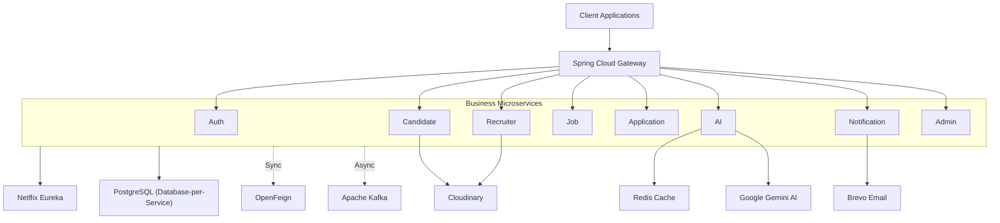
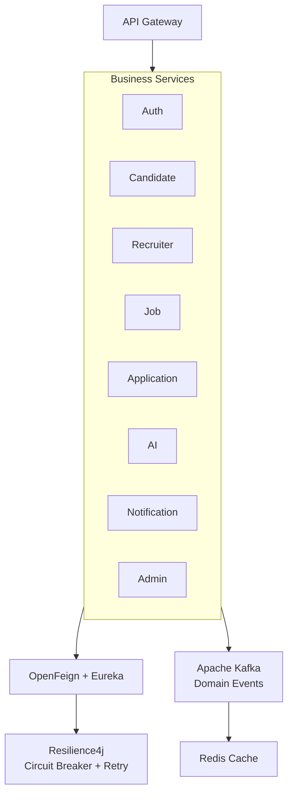
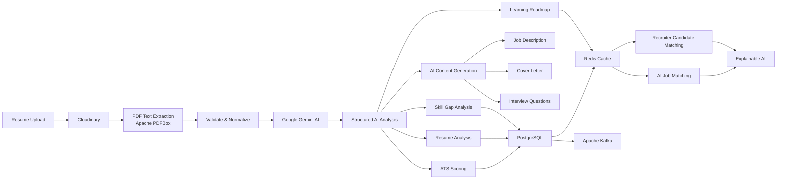
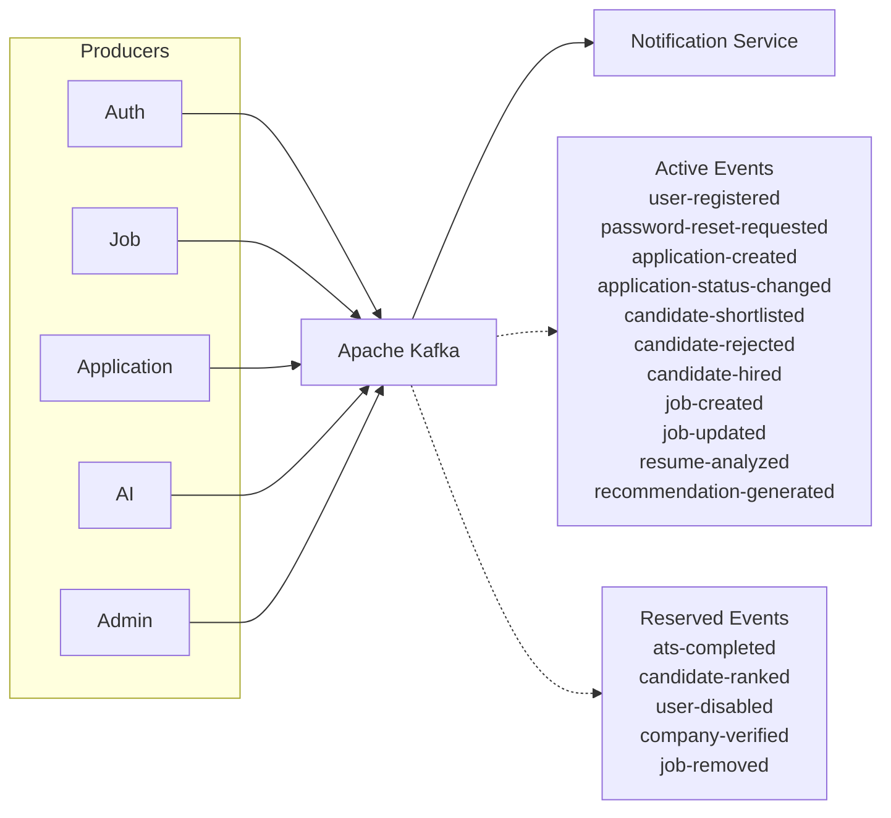
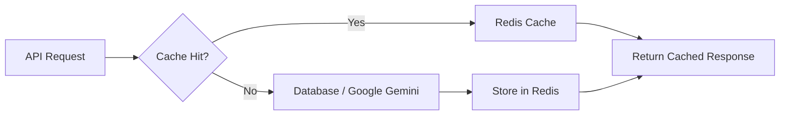
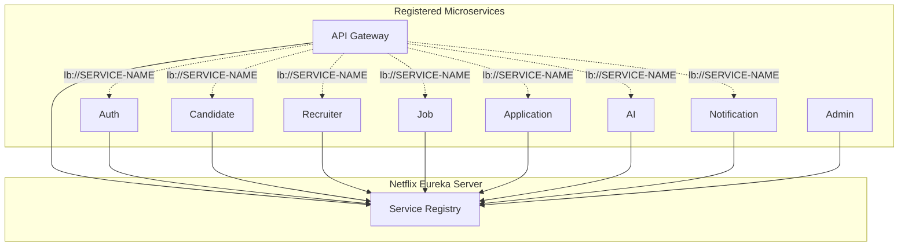
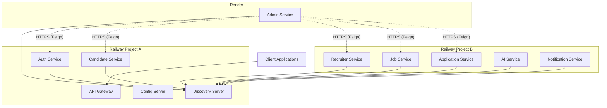
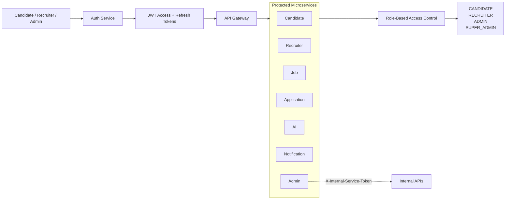
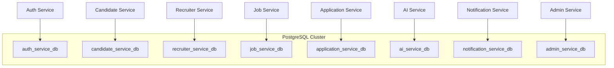

<div align="center">

# AI Job Portal — Backend

### Production-grade, event-driven microservices backend with AI-powered resume intelligence

**Java 21 · Spring Boot 3 · Spring Cloud · Apache Kafka · Redis · PostgreSQL · Google Gemini**

[](https://openjdk.org/)
[](https://spring.io/projects/spring-boot)
[](https://spring.io/projects/spring-cloud)
[](https://spring.io/projects/spring-security)
[](https://github.com/OpenFeign/feign)
[](https://resilience4j.readme.io/)
[](https://kafka.apache.org/)
[](https://redis.io/)
[](https://www.postgresql.org/)
[](https://www.docker.com/)
[](https://ai.google.dev/gemini-api)
[](https://swagger.io/)


[](./LICENSE)

</div>

---

A backend-only, **AI Job Portal** platform built as **11 independently
deployable Spring Boot microservices** behind a single API Gateway —
covering candidate, recruiter, and admin workflows, Gemini-powered resume
intelligence, and a real event-driven core.

| | |
|---|---|
|  **Production Ready** | Two-stage Docker builds, health checks, circuit breakers, retries, live on a real multi-cloud topology |
|  **AI Powered** | Google Gemini structured generation for resume analysis, ATS scoring, matching, and content drafting |
|  **Microservices** | 11 bounded-context services + Gateway + Config Server + Discovery Server, one database each |
|  **Spring Boot** | Java 21, Spring Boot 3, full Spring Cloud stack (Gateway, Eureka, Config, OpenFeign, Resilience4j) |
|  **Event Driven** | Apache Kafka, 16 domain events across 6 producing services |
|  **Multi-Cloud** | Split across two Railway projects and Render, with a custom Eureka public-hostname registration scheme |

<div align="center">

###  Project Statistics

| | | |
|---|---|---|
| **11 Microservices** | **Java 21** | **Spring Boot 3** |
| Spring Cloud | Apache Kafka | Redis |
| PostgreSQL | Google Gemini AI | Docker |
| JWT + RBAC | OpenFeign | Resilience4j |
| Railway + Render | 16 Kafka Events | 12 Maven Modules |

</div>

---

## Table of Contents

**Getting Oriented** — [Overview](#1-project-overview) · [Live Deployment](#2-live-backend-deployment) · [Key Highlights](#3-key-highlights) · [Technology Stack](#4-technology-stack)

**Architecture** — [Backend Architecture](#5-backend-architecture) · [Service Communication](#6-service-communication) · [AI Processing Flow](#7-ai-processing-flow) · [Kafka Event Flow](#8-kafka-event-flow) · [Redis Cache Flow](#9-redis-cache-flow) · [Eureka Discovery Flow](#10-eureka-discovery-flow) · [Multi-Cloud Deployment](#11-multi-cloud-deployment-architecture) · [Security Architecture](#12-security-architecture) · [Database Architecture](#13-database-architecture)

**Working With the Repo** — [Folder Structure](#14-folder-structure) · [Environment Variables](#15-environment-variables) · [Local Development](#16-local-development) · [Docker](#17-docker) · [API Documentation](#18-api-documentation)

**Project Scope** — [Current Features](#19-current-features) · [Future Roadmap](#20-future-roadmap) · [Design Principles](#21-design-principles) · [Engineering Highlights](#22-engineering-highlights) · [License](#23-license) · [Author](#24-author) · [Support](#25-support)

---

## 1. Project Overview

This repository contains the **backend only** for an AI Job Portal that
connects three roles — **Candidates**, **Recruiters**, and **Admins** —
through eleven independently deployable Spring Boot services fronted by
a single API Gateway.

| Role | What they can do |
|---|---|
| **Candidate** | Build a profile, upload resumes, get AI resume analysis + ATS scoring, discover skill gaps, receive AI-ranked job recommendations |
| **Recruiter** | Manage a company profile, post jobs, draft job descriptions & interview questions with AI, get AI-ranked candidates per job |
| **Admin** | Moderate users, companies, and jobs; monitor application/AI/notification activity through a dedicated audit trail |

The system follows **one bounded context per service** — no service
shares another's database, and all inter-service traffic flows only
through **OpenFeign** (synchronous) or **Kafka** (asynchronous). There is
no direct, un-brokered database access across service boundaries.

---

## 2. Live Backend Deployment

> Replace the placeholders below with your own deployed URLs.

| Resource | URL | Status |
|---|---|---|
| Backend API (Gateway) | `https://ample-grace-production-0968.up.railway.app` | Available 
| Gateway Health Check | `https://ample-grace-production-0968.up.railway.app/actuator/health` | Available
| Eureka Dashboard | `https://ai-jobportal.up.railway.app` | Available
| GitHub Repository | `https://github.com/PRAHLAD09-dev/ai-job-portal/tree/main/ai-job-portal-backend` | Available


---

## 3. Key Highlights

| Capability | Detail |
|---|---|
|  AI Resume Analysis | Gemini-backed ATS score, strengths, weaknesses, missing skills, recommendations |
|  ATS Compatibility Scoring | Lightweight, non-persisted formatting + keyword-gap check |
|  Skill Gap & Learning Roadmap | Priority-ordered missing skills plus a beginner → advanced learning path |
|  Explainable AI Matching | Job & candidate matches broken down across 6 scored dimensions with reasoning |
|  Recruiter Candidate Matching | Gemini-ranked applicant ranking, scoped to the recruiter's own company |
|  AI Content Generation | Job descriptions, cover letters, interview questions |
|  Event-Driven Core | 16 Kafka events across 6 producing services, one consumer group |
|  Redis Caching | AI results, job listings, popular skills, gateway rate limiting |
|  JWT Auth | Access + refresh tokens, BCrypt password hashing |
|  RBAC | `CANDIDATE` / `RECRUITER` / `ADMIN` / `SUPER_ADMIN` |
|  Fully Dockerized | 12-module Maven reactor, one container per service |
|  Real Multi-Cloud Deployment | Two Railway projects + Render, public-hostname Eureka registration |

---

## 4. Technology Stack

<table>
<tr><td valign="top">

**Core**
- Java 21
- Spring Boot 3.x
- Maven (multi-module reactor)

**Spring Cloud**
- Gateway (reactive)
- Netflix Eureka
- Config Server (file-backed)
- OpenFeign
- Resilience4j (Circuit Breaker + Retry)

</td><td valign="top">

**Persistence**
- PostgreSQL 16 — one database per service
- Spring Data JPA
- Flyway migrations

**Messaging & Cache**
- Apache Kafka (KRaft, no ZooKeeper)
- Redis (cache + gateway rate limiting)

</td><td valign="top">

**Security**
- Spring Security
- JWT (JJWT, HS256)
- BCrypt

**AI & Integrations**
- Google Gemini (structured JSON generation)
- Apache PDFBox (server-side resume PDF text extraction)
- Cloudinary (resume / company assets)
- Brevo (transactional email API)

**Tooling**
- MapStruct · Lombok
- springdoc-openapi (Swagger)
- JUnit 5 · Mockito · AssertJ
- Docker / Docker Compose

</td></tr>
</table>

---

# System Architecture

The AI Job Portal follows a **Distributed Event-Driven Microservices Architecture**. All client requests enter through **Spring Cloud Gateway**, which provides routing, CORS, and centralized request handling. Business services are discovered dynamically using **Netflix Eureka**, communicate synchronously through **OpenFeign**, and exchange asynchronous events using **Apache Kafka**. Each microservice owns its own PostgreSQL database following the **Database-per-Service** pattern, while **Redis** accelerates frequently accessed data and **Google Gemini AI** powers intelligent recruitment features.



---
## 6. Service Communication

The platform uses a hybrid communication model. **Synchronous requests** between microservices are handled through **OpenFeign** with **Netflix Eureka** service discovery and protected by **Resilience4j** Circuit Breaker and Retry mechanisms. **Asynchronous workflows** are powered by **Apache Kafka**, enabling loosely coupled, event-driven communication, while **Redis** provides caching and API Gateway rate limiting.



### Communication Strategy

| Communication Type | Technology | Purpose |
|--------------------|------------|----------|
| Synchronous | OpenFeign + Eureka | Request/Response between services |
| Fault Tolerance | Resilience4j | Circuit Breaker & Retry |
| Asynchronous | Apache Kafka | Event-Driven Communication |
| Caching | Redis | Performance & Gateway Rate Limiting |

> **Design Principle**
>
> External clients communicate **only through the API Gateway**. Microservices never expose themselves directly. Services communicate synchronously through **OpenFeign** for immediate responses and asynchronously through **Apache Kafka** for loosely coupled, fire-and-forget event processing.

## 7. AI Processing Flow

The AI Service automatically processes uploaded resumes through a structured pipeline. Resume PDFs are uploaded by the Candidate Service, stored in Cloudinary, processed using Apache PDFBox, analyzed by Google Gemini AI, cached with Redis, persisted where applicable, and exposed through explainable REST APIs.



### AI Pipeline Highlights

| Stage | Technology | Purpose |
|--------|------------|----------|
| Resume Storage | Cloudinary | Secure PDF storage |
| Text Extraction | Apache PDFBox | Server-side PDF parsing |
| AI Processing | Google Gemini AI | Structured JSON generation |
| Persistence | PostgreSQL | Resume analysis & ATS results |
| Caching | Redis | Faster repeated AI requests |
| Event Streaming | Apache Kafka | Async domain events |
| Explainable AI | MatchBreakdownResponse | Transparent recommendation reasoning |

> **Engineering Highlights**
>
> - The frontend submits only a **resumeUrl**; raw resume text is never required.
> - `ResumeTextExtractionService` downloads the PDF, validates file signatures, extracts text using **Apache PDFBox**, normalizes whitespace, and rejects corrupted, encrypted, oversized, or image-only PDFs.
> - A **SHA-256 hash** of the extracted text prevents duplicate resume analysis and unnecessary Gemini API calls.
> - AI recommendations include **six-dimensional explainable scoring** (Skills, Experience, Education, Projects, Salary, and Location) together with human-readable reasoning.
> - Learning Roadmaps are **Redis-cached** and generated dynamically instead of being persisted, ensuring recommendations always reflect the latest candidate profile and market context.
> - Every AI prompt is sanitized through **UntrustedTextGuard**, and recommendation workflows publish Kafka domain events for downstream services.
## 8. Kafka Event Flow

Apache Kafka enables asynchronous communication between microservices. Business services publish domain events without depending on downstream consumers, while the Notification Service processes all active notification events through a single consumer group.



### Event Summary

| Category | Topics |
|----------|--------|
| Active Events | 11 |
| Reserved Events | 5 |
| Consumer Group | `notification-service-group` |
| Messaging Pattern | Event-Driven, Asynchronous |

> **Note:** Active events are consumed by the Notification Service through a single Kafka consumer group, while reserved events are published for future platform workflows.

## 9. Redis Cache Flow



### Cached Components

| Service | Cached Data | Strategy |
|----------|-------------|----------|
| AI Service | Resume Analysis, ATS Score, Job Match, Skill Gap, Learning Roadmap | Cache Evict + TTL |
| Job Service | Job Listings, Categories, Popular Skills | TTL |
| Application Service | Application Read Models | TTL |
| API Gateway | Request Rate Limiter | Redis Token Bucket |

---
## 10. Eureka Service Discovery



> **Note:** Services register themselves using `spring.application.name`. The API Gateway and OpenFeign clients resolve services dynamically through Eureka using `lb://SERVICE-NAME`, eliminating hardcoded host and port dependencies.

---

## 11. Multi-Cloud Deployment Architecture

The backend is deployed across **multiple cloud platforms**. Core infrastructure services run in one Railway project, business microservices in another Railway project, while the Admin Service is deployed independently on Render. All services register with Eureka using **public HTTPS hostnames**, enabling seamless cross-platform service discovery and communication.



### Deployment Summary

| Platform | Services |
|----------|----------|
| Railway Project A | Config Server, Discovery Server, API Gateway, Auth Service, Candidate Service |
| Railway Project B | Recruiter Service, Job Service, Application Service, AI Service, Notification Service |
| Render | Admin Service |

> **Note:** Every service registers with Eureka using its **public HTTPS hostname** (`EUREKA_INSTANCE_HOSTNAME`). This enables seamless communication across multiple Railway projects and Render without relying on platform-specific private networking.

---

## 12. Security Architecture

The platform follows a **stateless JWT-based security model**. Authentication is centralized in the **Auth Service**, while every microservice independently validates JWT tokens and enforces role-based authorization. Internal service communication is protected using a shared **X-Internal-Service-Token**, and public access is restricted through the API Gateway.



### Security Layers

| Layer | Implementation |
|--------|----------------|
| Authentication | Spring Security + JWT Access & Refresh Tokens |
| Authorization | RBAC + `@PreAuthorize` |
| Password Security | BCrypt Password Hashing |
| Internal Communication | `X-Internal-Service-Token` |
| API Protection | Spring Cloud Gateway |
| Rate Limiting | Redis Token Bucket |
| Secrets Management | Environment Variables |

> **Note:** JWTs are issued only by the **Auth Service**. Every microservice validates tokens independently, while internal APIs are protected using a dedicated service token instead of user credentials.

---
## 13. Database Architecture

The platform follows the **Database-per-Service** pattern, where each microservice owns its own PostgreSQL database. Services never access another service's schema directly and communicate only through APIs and events.



### Database Design Principles

| Principle | Description |
|-----------|-------------|
| Database per Service | Every microservice owns its own schema |
| Independent Migrations | Flyway manages schema versioning |
| No Cross-Service Joins | Services communicate through APIs & Kafka |
| Loose Coupling | No shared database access |

---

## 14. Project Structure

```text
ai-job-portal-backend
│
├── common/
├── config-repo/
├── config-server/
├── discovery-server/
├── api-gateway/
│
├── auth-service/
├── candidate-service/
├── recruiter-service/
├── job-service/
├── application-service/
├── ai-service/
├── notification-service/
├── admin-service/
│
├── docker/
├── docker-compose.yml
├── pom.xml
└── .env.example
```

### Standard Service Structure

```text
src/main/java
│
├── controller/
├── service/
├── service/impl/
├── repository/
├── entity/
├── dto/
├── mapper/
├── exception/
├── config/
├── security/
└── util/
```

> Every microservice follows the same feature-based package structure, ensuring consistency, maintainability, and scalability across the entire platform.

## 15. Environment Variables

The full, authoritative list lives in `.env.example`. Grouped summary:

```bash
# ── Infrastructure ─────────────────────────────────────────────
POSTGRES_USER / POSTGRES_PASSWORD / POSTGRES_PORT
REDIS_PORT                    # + optional REDIS_HOST/PASSWORD/SSL for cloud Redis
KAFKA_PORT / KAFKA_CONTROLLER_PORT
                               # + optional cloud broker SASL settings
EUREKA_PORT                   # + EUREKA_PREFER_IP_ADDRESS / EUREKA_INSTANCE_HOSTNAME
CONFIG_SERVER_PORT

# ── API Gateway ────────────────────────────────────────────────
GATEWAY_PORT
FRONTEND_ORIGIN                # CORS allowed origin

# ── Auth Service ───────────────────────────────────────────────
AUTH_SERVICE_PORT
JWT_SECRET / JWT_REFRESH_SECRET
JWT_ACCESS_TOKEN_EXPIRATION_MS / JWT_REFRESH_TOKEN_EXPIRATION_MS
EMAIL_VERIFICATION_TOKEN_EXPIRATION_MS / PASSWORD_RESET_TOKEN_EXPIRATION_MS
MAX_FAILED_LOGIN_ATTEMPTS
BREVO_API_KEY / MAIL_FROM / MAIL_FROM_NAME
ADMIN_BOOTSTRAP_ENABLED / ADMIN_BOOTSTRAP_EMAIL / ADMIN_BOOTSTRAP_PASSWORD

# ── Candidate / Recruiter Service (Cloudinary) ────────────────
CANDIDATE_SERVICE_PORT / RECRUITER_SERVICE_PORT
CLOUDINARY_CLOUD_NAME / CLOUDINARY_API_KEY / CLOUDINARY_API_SECRET
RESUME_MAX_FILE_SIZE(_BYTES) / RESUME_CLOUDINARY_FOLDER
COMPANY_ASSET_MAX_FILE_SIZE(_BYTES) / COMPANY_LOGO_.. / COMPANY_BANNER_.._FOLDER

# ── Job / Application Service ─────────────────────────────────
JOB_SERVICE_PORT / APPLICATION_SERVICE_PORT

# ── AI Service ─────────────────────────────────────────────────
AI_SERVICE_PORT
GEMINI_API_KEY

# ── Notification Service ──────────────────────────────────────
NOTIFICATION_SERVICE_PORT

# ── Admin Service ──────────────────────────────────────────────
ADMIN_SERVICE_PORT
INTERNAL_SERVICE_TOKEN         # shared secret, Admin Service ↔ 6 downstream services
AUTH_SERVICE_URL / JOB_SERVICE_URL / RECRUITER_SERVICE_URL /
APPLICATION_SERVICE_URL / AI_SERVICE_URL / NOTIFICATION_SERVICE_URL
                                # cross-platform Feign overrides, only needed
                                # when admin-service is on a different platform
```

---

## 16. Local Development

The project can be developed either by running the complete Docker environment or by running a single microservice locally while the remaining infrastructure stays containerized.

### Option 1 — Full Local Setup

```bash
# 1. Start infrastructure
docker compose up -d postgres redis kafka

# 2. Create databases
docker/postgres-init/init-multiple-databases.sh

# 3. Configure environment variables
cp .env.example .env

# 4. Start services
Discovery Server
↓
Config Server
↓
API Gateway
↓
Business Services
↓
Admin Service
```

---

### Option 2 — Hybrid Development (Recommended)

Keep all infrastructure and other microservices running inside Docker, then start only the service you're currently developing directly from your IDE.

```bash
-DCONFIG_SERVER_URI=http://localhost:8888
-DEUREKA_URI=http://localhost:8761/eureka/
```

This allows the local service to register with the same Eureka Server and Config Server as the Dockerized services, enabling faster development and debugging without rebuilding the entire platform.
---

## 17. Docker

Every service is a two-stage Docker build — Maven build stage → slim JRE
runtime stage. Because the parent `pom.xml` is a multi-module Maven
reactor, every service's Dockerfile copies **every module's** `pom.xml`
before building, letting the reactor resolve the full `<modules>` list —
even though only that service's own module is actually compiled and
packaged.

```bash
docker compose build                     # build all 12 images
docker compose build admin-service       # build just one
docker compose up -d                     # start everything, detached
docker compose up -d admin-service       # start one (+ its depends_on chain)
docker compose ps                        # container / health status
docker compose logs -f admin-service     # tail logs
docker compose restart admin-service
docker compose down                      # stop everything
docker compose down -v                   # stop + wipe volumes (fresh DBs)
```

---

## 18. API Documentation

| Service | Swagger UI |
|---|---|
| Auth Service | `https://happy-perfection-production-1a75.up.railway.app/swagger-ui/index.html` |
| Candidate Service | `https://overflowing-delight-production-3a2c.up.railway.app/swagger-ui/index.html` |
| Recruiter Service | `https://ai-job-portal-production-aada.up.railway.app/swagger-ui/index.html` |
| Job Service | `https://shimmering-determination-production-dc97.up.railway.app/swagger-ui/index.html` |
| Application Service | `https://inspiring-light-production.up.railway.app/swagger-ui/index.html` |
| AI Service | `https://acceptable-courage-production-0eb6.up.railway.app/swagger-ui/index.html` |
| Notification Service | `https://balanced-miracle-production-260a.up.railway.app/swagger-ui/index.html` |
| Admin Service | `https://ai-job-portal-l8o1.onrender.com/swagger-ui/index.html` |

Every service also exposes Spring Boot Actuator's `/actuator/health`.
Internal-only `/internal/**` endpoints are documented under a dedicated
**"Internal - Admin"** Swagger tag for maintainer visibility, but are
unreachable from outside the Docker network — blocked at both the
Gateway and the service itself (see [§12](#12-security-architecture)).

---
## 19. Current Features

| Module | Features |
|---------|----------|
|  **Authentication** | Registration, Login, JWT Access & Refresh Tokens, Email Verification, Password Reset, Account Lockout, First Admin Bootstrap |
|  **Candidate** | Profile Management, Education, Experience, Skills, Resume Upload, AI Resume Analysis, ATS Scoring, Skill Gap Analysis, AI Job Recommendations |
|  **Recruiter** | Company Profile, Recruiter Profile, Job Posting, Candidate Ranking, Company Assets & Social Links |
|  **Job Management** | Job CRUD, Categories, Search, Filtering, Saved Jobs, Job Alerts |
|  **Applications** | Job Applications, Status Tracking, Interviews, Offers, Recruiter & Candidate Workflows |
|  **AI Services** | PDF Resume Extraction, Resume Analysis, ATS Scoring, Skill Gap Analysis, Learning Roadmap, Explainable Job Matching, Candidate Matching, AI Job Description, Cover Letter & Interview Question Generation |
|  **Notifications** | In-App Notifications, Email Notifications, Kafka Event Consumers, User Notification Preferences |
|  **Admin** | Dashboard, User & Company Moderation, Job Moderation, Audit Logs, Platform Monitoring, Analytics |

> **Overall:** 11 Spring Boot Microservices • Event-Driven Architecture • Google Gemini AI • Apache Kafka • Redis • Spring Cloud • Docker • Production Deployment
---

## 20. Future Roadmap

| Category | Planned Enhancements |
|----------|----------------------|
| **AI** | OCR fallback for scanned or image-based resumes, improved AI recommendations, enhanced resume parsing accuracy |
|  **Authentication** | Platform-wide login auditing, enhanced session management, advanced security monitoring |
|  **Event-Driven Architecture** | Consume reserved Kafka events (`ats-completed`, `candidate-ranked`, `user-disabled`, `company-verified`, `job-removed`) as new workflows evolve |
|  **Admin Platform** | Parallelized dashboard aggregation, improved moderation tools, advanced analytics & reporting |
|  **Performance & Scalability** | User-based Gateway rate limiting, distributed caching optimizations, performance tuning |
|  **Observability** | Distributed tracing, centralized logging, full end-to-end integration testing, production monitoring |
|  **DevOps** | Managed PostgreSQL, Redis & Kafka, external secrets management, CI/CD pipeline enhancements, Kubernetes-ready deployment |

---

## 21. Design Principles

| Principle | Description |
|-----------|-------------|
| Database per Service | Every microservice owns its own PostgreSQL database with no shared schema. |
| Bounded Context | Service boundaries are aligned with business domains rather than technical layers. |
| Feature-Based Architecture | Consistent package structure across every microservice (`controller → service → repository → entity → dto → mapper`). |
| Stateless Authentication | JWT-based authentication with independent token validation across services. |
| Synchronous Communication | OpenFeign with Eureka Service Discovery for request-response interactions. |
| Asynchronous Communication | Apache Kafka for loosely coupled, event-driven workflows. |
| Fault Tolerance | Resilience4j Circuit Breaker and Retry protect synchronous service communication. |
| Centralized Configuration | Spring Cloud Config Server provides a single source of configuration. |
| API Gateway Pattern | All external traffic enters through a single API Gateway. |
| Redis Caching | Frequently accessed data and AI responses are cached for improved performance. |
| Zero Shared Database | Cross-service data is retrieved through APIs instead of direct database access. |
| AI-First Design | AI capabilities are isolated within a dedicated microservice for maximum modularity and reuse. |

---

## 22. Engineering Highlights

| Area | Implementation |
|------|----------------|
|  **Architecture** | Designed and deployed an event-driven platform using **11 independently deployable Spring Boot microservices** with Spring Cloud Gateway, Netflix Eureka, and Spring Cloud Config for scalable, distributed architecture. |
|  **Service Communication** | Implemented **OpenFeign** with **Resilience4j Circuit Breaker & Retry** for resilient synchronous communication and **Apache Kafka** for asynchronous, event-driven workflows. |
|  **Security** | Built a layered security model using **Spring Security**, **JWT Access & Refresh Tokens**, **RBAC**, **BCrypt**, Email Verification, Password Reset, and **X-Internal-Service-Token** authentication for internal APIs. |
|  **Deployment** | Deployed services across **multiple Railway projects** and **Render**, enabling secure cross-platform communication through **public Eureka registration** and HTTPS. |
|  **Artificial Intelligence** | Integrated **Google Gemini AI** for resume analysis, ATS scoring, explainable job matching, recruiter candidate ranking, skill-gap analysis, learning roadmap generation, and AI-powered content generation. |
|  **Data Architecture** | Applied the **Database-per-Service** pattern, ensuring each microservice owns its own PostgreSQL database while communicating exclusively through APIs and Kafka events. |
---

## 23. License

This project is licensed under the **MIT License** — see the
[`LICENSE`](./LICENSE) file for full details.

---

## 24. Author

<div align="center">

**Prahlad Bhakat**

Java FullStack Developer · B.Tech, Computer Science & Engineering
Java | Spring Boot | Microservices | AI | Distributed Systems | Cloud

[](https://github.com/PRAHLAD09-dev)
[](https://linkedin.com/in/prahlad-bhakat)
[](mailto:prahladbhakat05@gmail.com)

</div>

---

## 25. Support

If this project helped you or you found it useful as a reference,
consider giving it a ⭐ on GitHub — it genuinely helps.

---

<div align="center">

Built with Java 21, Spring Boot, and Spring Cloud.

</div>
