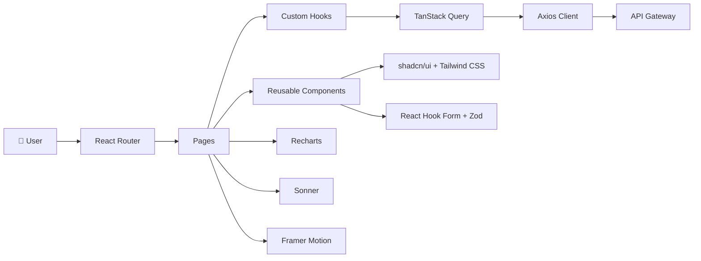
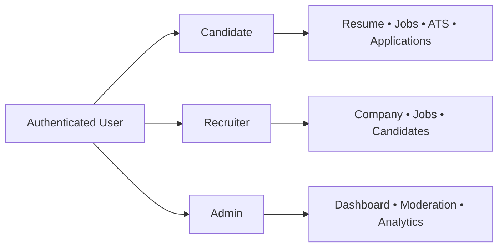
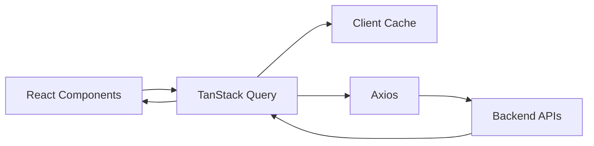
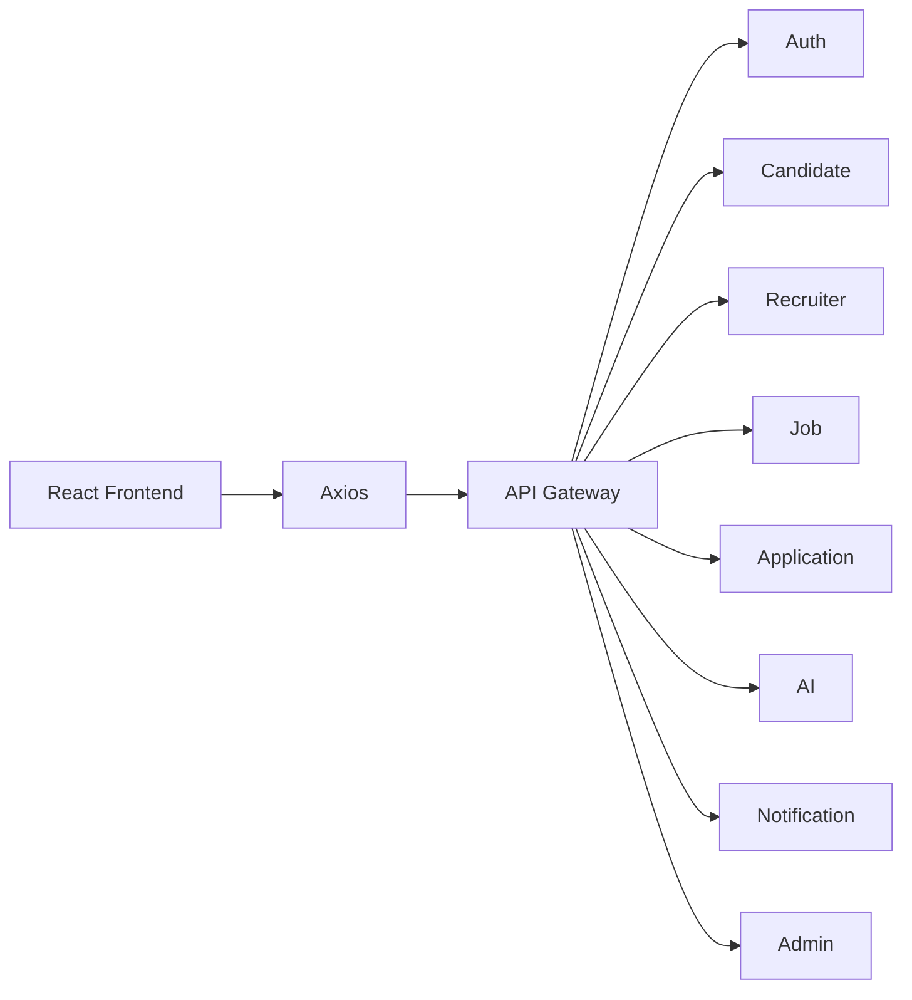
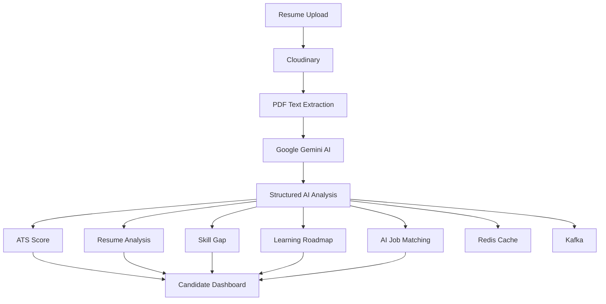
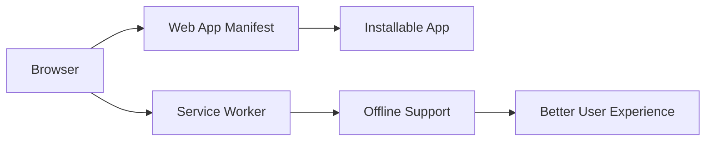
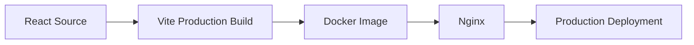

<div align="center">

# AI Job Portal — Frontend


**Production-Ready • AI-Powered • Responsive • Role-Based • Progressive Web App**

A modern frontend for an AI-powered recruitment platform built with **React 19**, **TypeScript**, and **Vite**, enabling intelligent hiring workflows for Candidates, Recruiters, and Administrators.

<br>

[](https://react.dev/)
[](https://www.typescriptlang.org/)
[](https://vitejs.dev/)
[](https://tailwindcss.com/)
[](https://tanstack.com/query)
[](https://www.docker.com/)
[](https://vercel.com/)
[](./LICENSE)

</div>

---

## Project Overview

The **AI Job Portal Frontend** is a production-ready React application that provides a complete recruitment experience for **Candidates**, **Recruiters**, and **Administrators**. It communicates exclusively with the backend through a single API Gateway and delivers AI-powered resume analysis, ATS scoring, intelligent job matching, recruiter dashboards, and modern responsive user interfaces.

---

## Project Highlights

| | | |
|---|---|---|
| **React 19** | **TypeScript** | **Vite 6** |
| Tailwind CSS 4 | TanStack Query | React Router 7 |
| React Hook Form | Zod Validation | Axios |
| PWA Ready | Docker | Vercel |
| Dark Mode | Responsive UI | Role-Based Access |

---

## Live Demo

| Resource | URL |
|----------|-----|
| 🌐 Frontend | `https://ai-job-portal-opal-iota.vercel.app/` |
| 🚀 Backend API-Gateway | `https://ample-grace-production-0968.up.railway.app` |
| 📦 Backend Repository | `https://github.com/PRAHLAD09-dev/ai-job-portal/tree/main/ai-job-portal-backend` |
| 🎨 Frontend Repository | `https://github.com/PRAHLAD09-dev/ai-job-portal/tree/main/ai-job-portal-frontend` |

---

# Screenshots

| Feature | Preview |
|----------|---------|
| Landing Page |  |
| Login |  |
| Candidate Dashboard |  |
| Recruiter Dashboard |  |
| Admin Dashboard |  |
| Resume Analysis |  |
| ATS Score |  |
| AI Job Match |  |
| Company Profile |  |
| Mobile View |  |
| Dark Theme |  |

---

# Core Features

### 🔐 Authentication

- JWT Authentication
- Email Verification
- Forgot & Reset Password
- Protected Routes
- Role-Based Authorization

### 👨‍💼 Candidate

- Resume Management
- AI Resume Analysis
- ATS Score
- Skill Gap Analysis
- AI Job Recommendations
- Saved Jobs
- Job Alerts
- Application Tracking

### 🏢 Recruiter

- Company Management
- Job Posting
- Candidate Management
- AI Candidate Ranking
- AI Job Description Generation

### 🛡️ Admin

- User Management
- Company Verification
- Job Moderation
- Platform Dashboard

### 🤖 AI Features

- Resume Analysis
- ATS Scoring
- Skill Gap Analysis
- Job Matching
- Candidate Matching
- Cover Letter Generator
- Interview Question Generator

---

# Technology Stack

| Category | Technologies |
|----------|--------------|
| **Frontend** | React 19, TypeScript, Vite |
| **Styling** | Tailwind CSS 4, Radix UI, shadcn/ui |
| **State Management** | TanStack Query |
| **Forms** | React Hook Form, Zod |
| **Routing** | React Router 7 |
| **Charts** | Recharts |
| **Animations** | Framer Motion |
| **Icons** | Lucide React |
| **Notifications** | Sonner |
| **HTTP Client** | Axios |
| **Deployment** | Docker, Nginx, Vercel |

---

# Frontend Architecture

The frontend follows a **Feature-Based Modular Architecture**, separating UI components, business logic, routing, API communication, and reusable utilities. State synchronization is handled using **TanStack Query**, while forms are validated with **React Hook Form** and **Zod**. All backend communication flows through the **API Gateway**, keeping the frontend independent of individual microservices.



---

# Application Flow

```mermaid
flowchart LR

    User["User"]
        --> Login["Authentication"]

    Login
        --> JWT["JWT Access Token"]

    JWT
        --> Dashboard["Role Dashboard"]

    Dashboard
        --> Features["Application Features"]

    Features
        --> API["REST APIs"]

    API
        --> Gateway["Spring Cloud Gateway"]

    Gateway
        --> Services["Backend Microservices"]
```



---

# Role-Based Navigation



---

# State Management



---

# API Communication



---

# Folder Structure

```text
ai-job-portal-frontend/
│
├── public/
│
├── src/
│   ├── assets/
│   ├── components/
│   │   ├── common/
│   │   ├── ui/
│   │   ├── forms/
│   │   ├── layout/
│   │   └── shared/
│   │
│   ├── pages/
│   │   ├── auth/
│   │   ├── candidate/
│   │   ├── recruiter/
│   │   ├── admin/
│   │   └── public/
│   │
│   ├── hooks/
│   ├── services/
│   ├── lib/
│   ├── utils/
│   ├── types/
│   ├── routes/
│   ├── context/
│   ├── constants/
│   └── App.tsx
│
├── Dockerfile
├── nginx.conf
├── vite.config.ts
├── package.json
└── README.md
```

---

# Frontend Design Principles

| Principle | Description |
|-----------|-------------|
| Component-Based | Reusable UI components with clear separation of concerns |
| Feature-Based Structure | Code organized by business features instead of file types |
| API-First | All data fetched from backend REST APIs through API Gateway |
| Server State | TanStack Query manages caching, synchronization, and background refetching |
| Form Validation | React Hook Form with Zod schema validation |
| Responsive Design | Mobile-first layouts built using Tailwind CSS |
| Role-Based UI | Separate dashboards and navigation for Candidate, Recruiter, and Admin |
| Type Safety | End-to-end TypeScript support across the application |

---

# Authentication Flow

The frontend uses **JWT-based authentication** with role-based routing. After successful login, the access token is securely stored and automatically attached to protected API requests using Axios interceptors. Unauthorized requests trigger token refresh or redirect users back to the login page.

```mermaid
flowchart LR

    User["👤 User"]
        --> Login["Login Form"]

    Login
        --> Auth["Auth Service"]

    Auth
        --> JWT["JWT Access Token"]

    JWT
        --> Storage["Secure Storage"]

    Storage
        --> Axios["Axios Interceptor"]

    Axios
        --> Gateway["API Gateway"]

    Gateway
        --> Services["Protected APIs"]

    Services
        --> UI["Role-Based Dashboard"]
```



---

# AI Features Flow



---

# Performance Optimizations

| Optimization | Implementation |
|--------------|----------------|
| Code Splitting | React Lazy + Dynamic Imports |
| Data Caching | TanStack Query |
| Background Refetch | Automatic Query Synchronization |
| Optimistic Updates | Instant UI Feedback |
| Image Optimization | Cloudinary |
| Form Validation | React Hook Form + Zod |
| API Reuse | Shared Axios Instance |
| Error Handling | Global Error Boundary |
| Loading States | Skeleton UI & Loaders |
| Responsive Design | Mobile-First Tailwind CSS |

---

# Progressive Web App



---

# Docker Deployment



---

# Environment Variables

| Variable | Description |
|----------|-------------|
| `VITE_API_BASE_URL` | Backend API Gateway URL |
| `VITE_APP_NAME` | Application Name |
| `VITE_APP_VERSION` | Frontend Version |

Example:

```env
VITE_API_BASE_URL=http://localhost:8080/api/v1
VITE_APP_NAME=AI Job Portal
VITE_APP_VERSION=1.0.0
```

---

# Local Development

### Clone Repository

```bash
git clone https://github.com/PRAHLAD09-dev/ai-job-portal-frontend.git
cd ai-job-portal-frontend
```

### Install Dependencies

```bash
npm install
```

### Start Development Server

```bash
npm run dev
```

Application:

```
http://localhost:5173
```

---

# Production Build

```bash
npm run build
```

Preview Production Build

```bash
npm run preview
```

---

# Deployment

| Platform | Status |
|----------|--------|
| Vercel | ✅ Production |
| Docker | ✅ Supported |
| Nginx | ✅ Configured |

Deployment Process

```text
GitHub
      │
      ▼
Vercel Build
      │
      ▼
Vite Production Build
      │
      ▼
Static Assets
      │
      ▼
Global CDN
```

---
# Current Features

| Module | Features |
|---------|----------|
| 🔐 Authentication | Login, Registration, JWT Authentication, Email Verification, Password Reset, Protected Routes |
| 👤 Candidate | Resume Upload, Profile Management, ATS Score, Resume Analysis, Skill Gap Analysis, AI Job Matching, Saved Jobs, Job Applications |
| 🏢 Recruiter | Company Profile, Job Management, Candidate Management, AI Candidate Ranking, AI Job Description Generation |
| 🛡️ Admin | Dashboard, User Management, Company Verification, Job Moderation, Platform Analytics |
| 🤖 AI | Resume Analysis, ATS Scoring, Job Matching, Candidate Matching, Learning Roadmap, Cover Letter Generator, Interview Question Generator |
| 📱 Frontend | Responsive Design, Dark Mode, Progressive Web App, Role-Based UI |

---

# Future Roadmap

| Area | Planned Improvements |
|------|----------------------|
| Authentication | Multi-Factor Authentication (MFA) |
| AI | OCR Support for Scanned Resumes |
| Notifications | Real-time WebSocket Notifications |
| Collaboration | Recruiter Notes & Team Collaboration |
| Performance | Advanced Lazy Loading & Bundle Optimization |
| Analytics | Enhanced Recruiter Insights & Reports |
| Mobile | React Native Mobile Application |

---

# Engineering Highlights

| Area | Implementation |
|------|----------------|
|  Architecture | Feature-Based React Architecture with reusable components and modular organization |
|  Performance | TanStack Query caching, lazy loading, code splitting, optimized rendering |
|  Security | JWT Authentication, Role-Based Access Control, Protected Routes |
|  AI Integration | ATS Scoring, Resume Analysis, Job Matching, Candidate Ranking, AI Content Generation |
|  User Experience | Mobile-First Responsive Design, Dark Mode, Accessible Components |
|  Deployment | Dockerized frontend deployed on Vercel with production-ready configuration |

---

# Project Structure Summary

| Category | Technology |
|----------|------------|
| Framework | React 19 |
| Language | TypeScript |
| Build Tool | Vite |
| Styling | Tailwind CSS 4 |
| Components | shadcn/ui + Radix UI |
| Routing | React Router 7 |
| State Management | TanStack Query |
| Forms | React Hook Form + Zod |
| Charts | Recharts |
| Notifications | Sonner |
| Deployment | Docker + Nginx + Vercel |

---

# Contributing

Contributions are welcome.

1. Fork the repository.
2. Create a feature branch.
3. Commit your changes.
4. Push to your fork.
5. Open a Pull Request.

---

# License

This project is licensed under the **MIT License**.

---

# Author

## Prahlad Bhakat

Computer Science graduate passionate about building scalable **Java Spring Boot**, **React**, **Microservices**, and **AI-powered** applications.

### Connect with Me

[](https://github.com/PRAHLAD09-dev)
[](https://linkedin.com/in/prahlad-bhakat)
[](mailto:prahladbhakat05@gmail.com)


---

# If you found this project helpful

⭐ Star the repository

🍴 Fork the repository

📝 Share your feedback

---

<div align="center">

## Thank You ❤️

Made with **React**, **TypeScript**, and lots of ☕

</div>